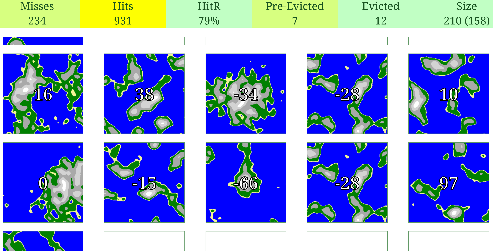

# Laminar Achipelago: Fantasy Maps Infinite Scroll with Scala.js and Laminar

## Table of Contents

1. [Overview](#overview)
2. [Key Observations](#key-observations)
3. [Technical Details](#technical-details)
   - [Seed Distribution](#seed-distribution)
   - [Workflow](#workflow)
   - [WeakRef Cache](#weakref-cache)
   - [Bloom Filter Enhancement](#bloom-filter-enhancement)
4. [Metrics](#metrics)
5. [How to Run](#how-to-run)
6. [Conclusion](#conclusion)

## Overview

This project demonstrates an infinite scroll mechanism that displays fantasy maps of small islands and archipelagos. It evaluates whether JavaScript `WeakRefs` can be used as a caching mechanism for efficiently managing memory and performance. The project utilizes Scala.js and Laminar for UI rendering and interaction.



## Key Observations

- The pure WeakRef cache is purged too aggressively due to opportunistic garbage collection.
- Cache hit rate improves under system load because the garbage collector delays purging.
- Adding a normal caching mechanism significantly boosts hit rates and reduces map regeneration.

## Technical Details

### Seed Distribution

Map seeds are integers sampled from a Gaussian distribution with:

- Mean (μ): 0
- Standard deviation (σ): 50

### Workflow

1. **Scrolling Event**: When a map comes into view, the system asks the cache for the bitmap corresponding to the seed.
2. **Cache Handling**: The cache either returns the bitmap directly or requests it from the Web Worker if not available.
3. **Map Generation**: The Web Worker generates the bitmap using Perlin noise.
4. **Cache Update**: The generated bitmap is handed back to the system and then stored in the cache, as the cache operates on the main thread.
5. **Rendering**: The bitmap is painted on the canvas.

### WeakRef Cache

- A WeakRef-based cache stores generated bitmaps temporarily.
- Cache entries are subject to garbage collection based on system memory pressure.

### Bloom Filter Enhancement

- A counting Bloom filter tracks the frequency of seed usage.
- Frequently accessed seeds are cached persistently, improving the hit rate.
- The Bloom filter does not hand out entries directly but merely prevents the garbage collector from reclaiming entries.

## Metrics

Metrics are logged to monitor cache performance:

- **Hits**: Number of successful cache lookups.
- **Misses**: Number of cache lookups that required regeneration.
- **Hit Rate**: Hits divided by total lookups.
- **Evictions**: The number of entries removed by garbage collection.
- **Pre-Evictions**: The number of items still in the cache because the FinalizationRegistry has not yet called its callback to remove them, but the WeakRef has already lost the content.
- **Cache Size**: Current size of the cache.

## How to Run

This is a normal Scala.js project integrated with Vite. To run it:

1. Install the necessary npm dependencies:
   ```bash
   npm install
   ```
2. Start the Scala.js build tool (sbt) and use the `~fastLinkJS` command to enable incremental compilation:
   ```bash
   sbt
   ~fastLinkJS
   ```
3. In a separate terminal, start the Vite development server:
   ```bash
   npm run dev
   ```
4. Open the application in a web browser. The development server will display the URL to open in the terminal.

## Dependencies

- **Scala.js**: For compiling Scala code to JavaScript.
- **Laminar**: For reactive UI rendering.

## Conclusion

This project was a test to see whether keeping entries in a map of WeakRefs is good enough. It turns out that it is not, because garbage collection is too aggressive. Adding another caching mechanism like a counting Bloom filter to prevent JavaScript from reclaiming the objects works well. However, in that case, just using a normal cache without any WeakRefs seems to be easier, and the bit of additional caching you get from using the WeakRefs does not seem worth it.
